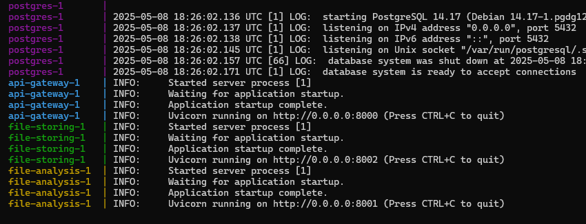
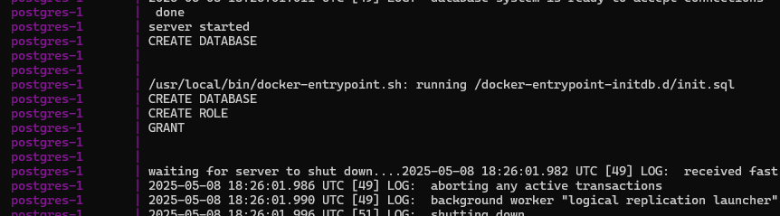
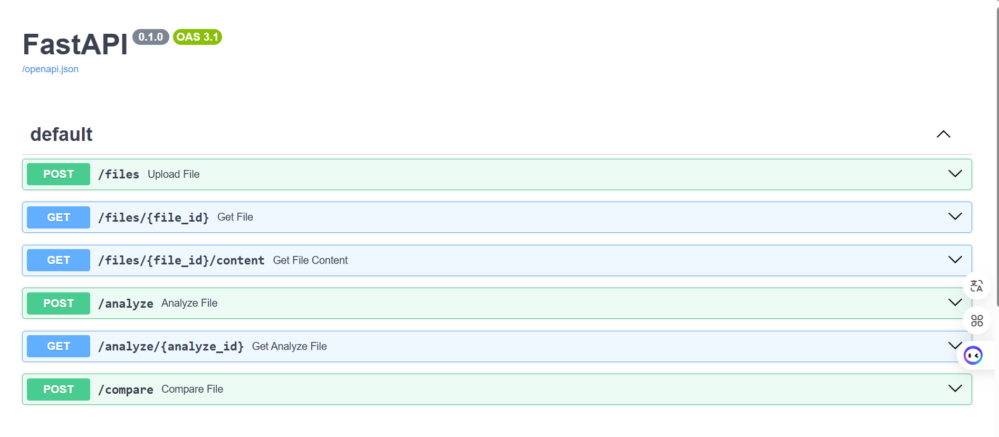
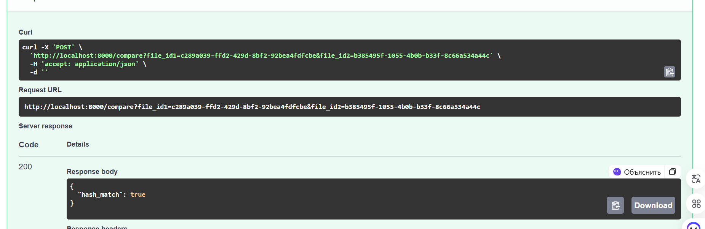
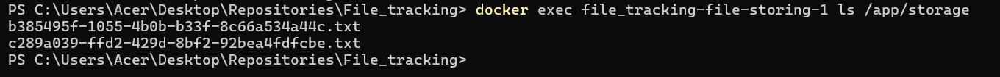

# Анализ файлов

Микросервисная система для анализа текстовых отчетов с функцией сравнения файлов.

## Структура проекта

```
File_Tracking/
├── api_gateway/                   # API Gateway: маршрутизация запросов
│ ├── app/
│ │ ├── init.py
│ │ ├── main.py                    # Точка входа
│ │ └── routes.py                  # Эндпоинты
│ ├── Dockerfile
│ └── requirements.txt
├── file_analysis_service/         # Сервис анализа файлов
│ ├── app/
│ │ ├── init.py                    
│ │ ├── main.py                    # Точка входа                   
│ │ ├── models.py                  # Описание таблиц бд 
│ │ ├── routers.py                 # Эндпоинты
│ │ └── database.py                # Взаимодействие с PostgreSQL
│ ├── Dockerfile
│ └── requirements.txt
├── file_storing_service/          # Хранилище файлов 
│ ├── app/
│ │ ├── storage/                   # Папка для хранения добавленных файлов
│ │ ├── init.py                    
│ │ ├── main.py                    # Точка входа
│ │ ├── models.py                  # Описание таблиц бд 
│ │ ├── routers.py                 # Эндпоинты
│ │ └── database.py                # Взаимодействие с PostgreSQL
│ ├── Dockerfile
│ └── requirements.txt
├── postgres/                    
│ └── init.sql                     # Скрипт для создания бд и user 
├── tests/                         # Юнит-тесты 
├── docker-compose.yml             # Оркестрация контейнеров
├── README.md                      # Эта документация
└── requirements.txt               # Общие зависимости
```

## Основные компоненты

### Микросервисы
1. **API Gateway** (порт 8000)
   - Обеспечивает маршрутизацию запросов к другим сервисам
   - Обрабатывает ошибки 

2. **File Analysis Service** (порт 8001):
   - Сравнение файлов на схожесть (по хешу)
   - Интеграция с WordCloudAPI для генерации облака слов (доп. функционал) ?? 
   - Сохраняет контент данных в бд PostgreSQL

3. **File Storing Service** (порт 8002):
   - Сохранение файлов в файловую систему
   - Выдача файлов по ID
   - Сохраняет контент данных в бд PostgreSQL

### База данных
- **PostgreSQL**: таблицы `files` (id, location, hash) и `analysers` (id, hash, content).

## Запуск проекта 
(самое интересное)

### Инструкция
1. Клонировать репозиторий:
   ```bash
   git clone https://github.com/Vikkasss/File-analyzer/
   ```
   
2. Переходим в папку проекта

```bash
   C:\Users\Acer\Desktop\Repositories\File_Tracking> 
```

3. Запускаем контейнер

```bash
    docker-compose up --build
```
Во время запуска `docker-compose.yml` будет написано очень много строк), в которых будет запускаться 4 образа: `postgres`, 3 `DockerFile` для остальных сервисов/api.
В конце должно выйти это: 





На фотографиях видно, что успешно мы запустили `postgres`, создав две бд (фото 2), а также успешно запустили два сервиса (`file-storing-1`, `file-analysis-1`) и маршрутизатор для них (`api-gateway-1`).

Далее в этом терминале нам будут приходить логи от запросов `get`, `post`

4. Переходим по [link](http://localhost:8000/docs#/) и можем тестировать наши запросы через Swagger UI)) ура: 



Мы с вами видим 5 запросов: 

- `post /files - upload file` - загрузка файла, сохранение в папку `/storage` сервиса `file_storing_service` и в бд.
- `get /files/{file_id}` - получение данных файла по его id
- `get /files/{file_id}/content` - просмотр содержимого файла по его id
- `post /analyze` - взятие текста файла из сервиса `file_storing_service`, подсчет статистики текста и сохранение в бд всех данных
- `get /analyze/{analyze_id}` - получение текста файла с его статистикой
- `post /compare` - сравнение файлов по id через их hash


Добавим три файла формата `.txt` (находятся в папке `for_the_report`), где два одинаковых и один нет.

Успешное добавление файла выглядит так: 


Проверить работу запроса `get` можно там же, а можно в поисковой строке, например введя такой [путь](http://localhost:8000/files/c289a039-ffd2-429d-8bf2-92bea4fdfcbe): 

```bash 
   http://localhost:8000/files/c289a039-ffd2-429d-8bf2-92bea4fdfcbe
```
В данном случае `c289a039-ffd2-429d-8bf2-92bea4fdfcbe` - `file_id` и при добавлении файлов он у всех разный)

Теперь проверим работу другого сервиса, протестировав запрос `post` для сравнения файлов

 
Выполнив `get` запрос по id файла мы увидим, что файлы `1.txt` и `2.txt` действительно имеют одинаковый хеш

А вот так выглядят логи в терминале, пока мы делали запросы:


Тут наглядно видно в какой момент использовался каждый сервис


5. Проверим хранение файлов в папке `/storage`



Название файлов соотвествует их `file_id` из таблицы `files`


